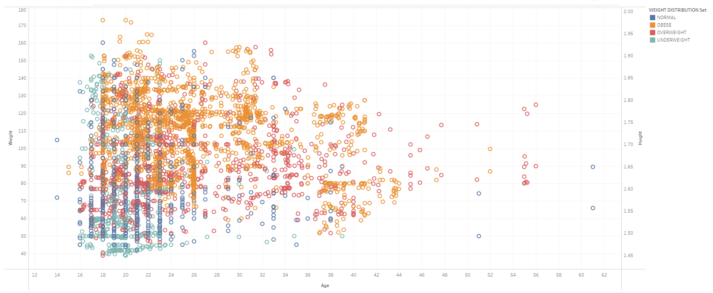
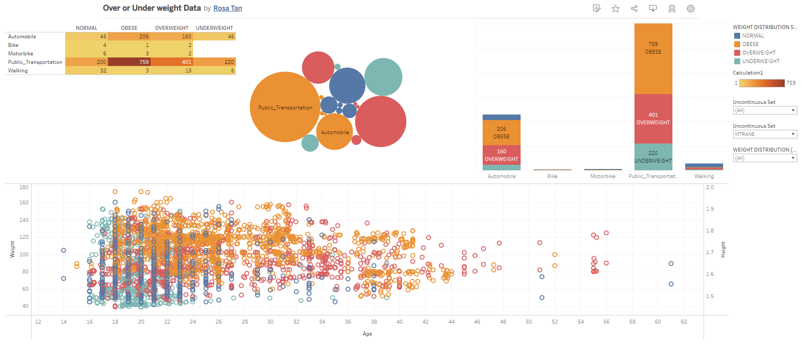

# Human Vs Machine
can you tell if you are over or underweight?

## About this project:
We often think that obesity cause by overeating, however that's not only the case. Nowadays, obesity has become a significant threat for all people from every age, worldwide. Unhealthy lifestyle, eating excessive junk food, late-night sleep, spend a long time sitting down are several factors that contribute to obesity.. "so, if I'm overweight do I mean i am also Obese? what is the difference between overweight and obese?"
Overweight is when the BMI greater than or equal to 25; and how we measure if we are obese is when the BMI (Body Mass Index) is greater than or equal to 30. If you are overweight, potentially you will become obese if precautions being ignored. 

  

 
## Approach
1. Identify data sources and dependencies
2. Collect and clean trajectory data
3. Applying Machine Learning algorithms (decision tree, Lasso, Random Forest Classifier, XGBClassifier)
4. Comparative Analysis
5. Create Flask App and connect routes to local host
6. Create charts and map using Tableau
7. Customise html for final application
8. Visualise dashboard locally

## **Architectural Diagram:**

## **Data Sources:**
Data is derived from the Kaggle dataset in order to illustrate the relationship between questionaire surveyed approximately 2000 participant. 
Questionaire: 
1. What is your gender? (Gender) = Female, Male						
2. what is your age? (Age) = Numeric value						
3. What is your height? (Height) = Numeric value in meters						
4. What is your weight? (Weight) = Numeric value in Kilograms						
5. Has a family member suffered or suffers from overweight? = Yes, No						
6. Do you eat high caloric food frequenlty? (FAVC) = Yes, No						
7. Do you usually eat vegatables in your meals? (FCVC) = 1-3 follow by usually meal						
8. How many main means do you have daily? (NCP) = Between 1 y 2, 3, more than 4						
9. Do you eat any food between mean? (CAEC) = No, Sometimes, Frequently, Always						
10. Do you smoke? (Smoke) = Yes, No						
11. How much water do you drink daily? (CH20) = less than a liter, between 1 and 2L, more than 2 L						
12. Do you monitor the calories you eat daily? (SCC) = Yes, No						
13. How often do you have physical activity? (FAF) = I do not have, 1 or 2 days, 2 or 4 days, 4 or 5 day						
14. How much time do you use technological devices? (TUE) = 0-2 hours, 3-5 hours, more than 5 hours						
15. How often do you drink alcohol? (CALC) =I don’t drink, Sometimes, Frequently, Always						
16. Which transportation do you usually use? (MTRANS) = Automobile, Motorbike, Bike Public Transportation, Walking						

## **Coding Languages:**

## **Data Bases:**

## **Platform:**

## **IDE:**

## **Limitations, Assumptions & Challenges:**
- 
- Restricted timeframe to complete project 4

## **Visualizations & Analysis:**

## **Observations:**

  

## **Website Design:**
This application includes 3 responsive webpages with dynamic navigation built using HTML, CSS, and using bootstrap .

## **Project Authors:**
Authors:

Ash Tao - https://github.com/Ash-Tao

Christian Adiputra - https://github.com/cadiputra

Dhiren Patel - https://github.com/DhirenkumarP

Patty - https://github.com/PBx0N

Rosa - https://github.com/oshabu

  

